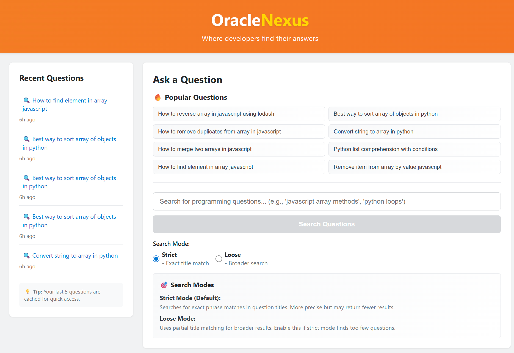
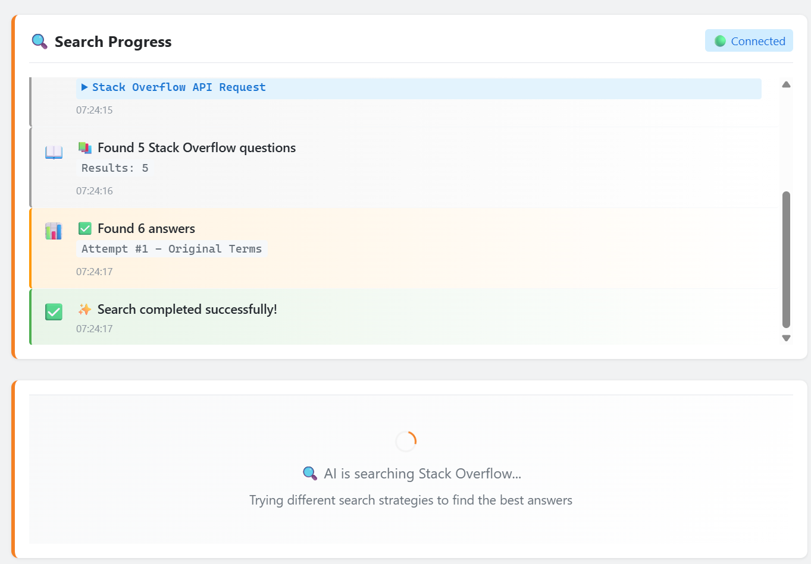
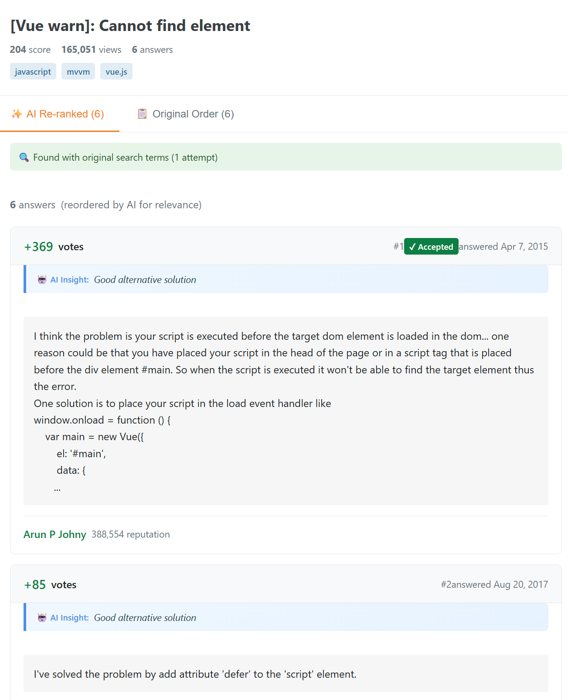
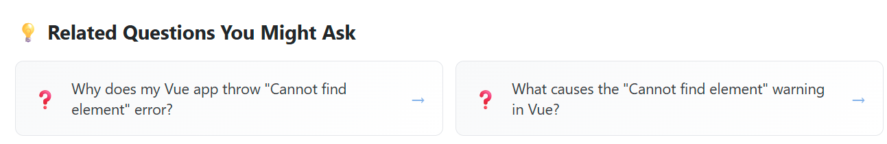
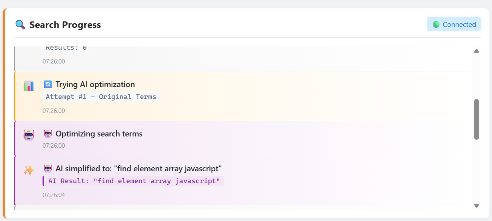
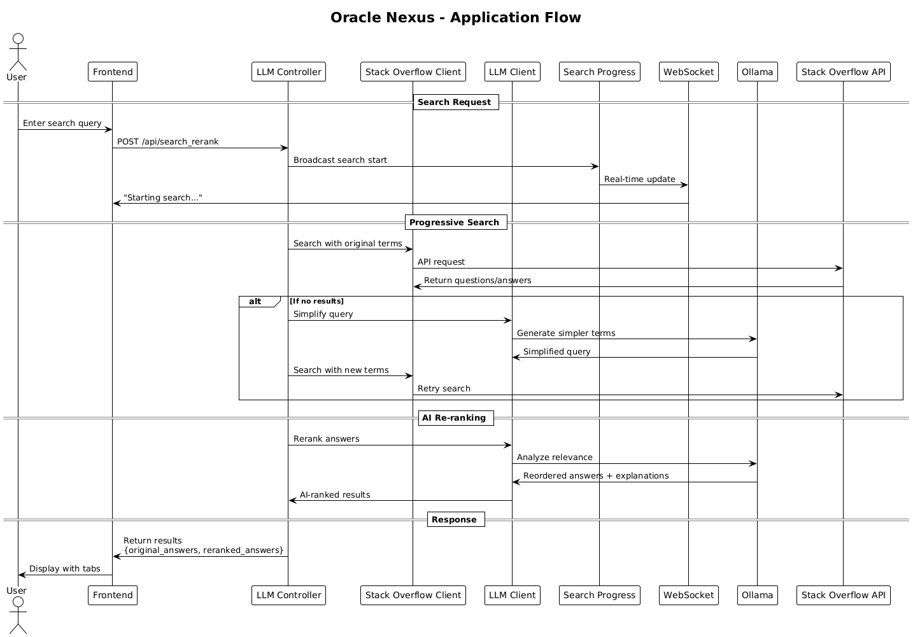

# Oracle Nexus - Stack Overflow Clone with AI

A full-stack Stack Overflow clone featuring AI-powered answer re-ranking and intelligent search strategies.

## 🚀 Features

- **Real Stack Overflow Integration** - Fetches actual questions and answers from Stack Overflow API
- **AI-Powered Answer Re-ranking** - Uses local LLM (Ollama) to intelligently reorder answers by relevance
- **Progressive Search Strategies** - AI-guided fallback search when initial queries fail
- **Real-time Search Progress** - WebSocket-powered live updates showing search strategies
- **Related Questions Generation** - AI suggests related questions based on search context
- **Strict/Loose Search Modes** - User-controlled search precision
- **Recent Questions Cache** - PostgreSQL database stores last 5 searches per user
- **Stack Overflow-like Design** - Authentic visual styling matching Stack Overflow

## 📸 Product Demo

### Main Interface

*Clean, Stack Overflow-inspired interface with popular questions, search modes, and recent questions sidebar. Features strict/loose search mode controls with detailed explanations.*

### Real-time Search Progress

*Live WebSocket updates showing search strategies, Stack Overflow API requests, and AI processing steps with timestamps and connection status.*

### Answer Display with AI Re-ranking

*Professional answer layout with AI re-ranking tabs, vote scores, accepted answers, and AI insights explaining relevance for each answer.*

### AI-Generated Related Questions

*Smart related question suggestions generated by local LLM based on the original search context, providing natural follow-up queries.*

### Progressive Search Intelligence

*AI-powered search optimization showing how the system transforms queries when initial searches fail, with transparent AI reasoning displayed.*

## 🏗️ Architecture

- **Frontend**: React TypeScript (oracle-nexus)
- **Backend**: Elixir Phoenix (oracle_sage)
- **Database**: PostgreSQL
- **LLM**: Ollama with llama3.2:1b model
- **Real-time**: WebSocket communication
- **Observability**: OpenTelemetry tracing
- **Deployment**: Docker Compose

### Application Flow


## 📋 Prerequisites

- Docker and Docker Compose
- Git

## 🚀 Quick Start

1. **Clone the repository**
   ```bash
   git clone <repository-url>
   cd oracledev
   ```

2. **Start the application**
   ```bash
   docker-compose up --build
   ```

3. **Wait for services to initialize**
   - Ollama will download the llama3.2:1b model (first run only)
   - PostgreSQL will initialize the database
   - Phoenix backend will start on port 4000
   - React frontend will start on port 3000

4. **Access the application**
   - Frontend: http://localhost:3000
   - Backend API: http://localhost:4000

## 🔧 Services

### Frontend (React - Port 3000)
- Modern React TypeScript application
- Real-time WebSocket integration
- Stack Overflow-inspired UI design
- Responsive design for mobile/desktop

### Backend (Elixir Phoenix - Port 4000)
- RESTful API endpoints
- Stack Overflow API integration
- WebSocket channels for real-time updates
- PostgreSQL database integration

### Database (PostgreSQL - Port 5432)
- User question caching
- Automatic cleanup of old records
- Ecto migrations for schema management

### LLM (Ollama - Port 11434)
- Local AI model deployment
- Answer re-ranking and relevance scoring
- Search query optimization
- Related questions generation

## 🎯 API Endpoints

- `POST /api/search_rerank` - Search with AI re-ranking
- `GET /api/recent_questions/:user_id` - Get recent searches
- WebSocket: `ws://localhost:4000/socket/websocket` - Real-time updates

## 🔍 How It Works

1. **User enters a question** in the search interface
2. **Progressive search strategy**:
   - Try original search terms
   - If no results, use AI to simplify query
   - If still no results, use AI for alternative terms
   - Final fallback to programming language detection
3. **Real-time feedback** shows each search attempt via WebSocket
4. **AI processes answers** to provide relevance explanations and re-ranking
5. **Related questions** are generated based on the original query
6. **Results cached** in PostgreSQL for quick recent access

## 🛠️ Development

### Frontend Development
```bash
cd oracle-nexus
npm install
npm start
```

### Backend Development
```bash
cd oracle_sage
mix deps.get
mix phx.server
```

### Database Operations
```bash
# Create database
docker-compose exec backend mix ecto.create

# Run migrations
docker-compose exec backend mix ecto.migrate

# Reset database
docker-compose exec backend mix ecto.reset
```

## 🔧 Configuration

### Environment Variables
- `DATABASE_URL` - PostgreSQL connection string
- `OLLAMA_HOST` - Ollama service URL (default: http://ollama:11434)
- `STACK_OVERFLOW_API_KEY` - Optional SO API key for higher rate limits
- `OTEL_EXPORTER_OTLP_ENDPOINT` - OpenTelemetry collector endpoint (optional)
- `OTEL_SERVICE_NAME` - Service name for tracing (default: oracle_sage_dev)

### Ollama Models
The application uses `llama3.2:1b` for fast local processing. To use a different model:
```bash
docker-compose exec ollama ollama pull <model-name>
```

## 📱 Usage Examples

### Search Modes
- **Strict Mode**: Exact title matching for precise results
- **Loose Mode**: Broader search for more results when strict fails

### Progressive Search
1. User searches: "how to sort array javascript performance"
2. No results found with full query
3. AI simplifies to: "sort array javascript"
4. Results found and displayed with explanation

### Real-time Updates
Watch the search progress panel to see:
- Strategy attempts (Original → AI Simplified → AI Alternative)
- Stack Overflow API requests with full URLs
- LLM processing steps
- Final results with answer counts

## 🐛 Troubleshooting

### Common Issues

1. **Ollama model download fails**
   ```bash
   docker-compose exec ollama ollama pull llama3.2:1b
   ```

2. **Database connection issues**
   ```bash
   docker-compose down
   docker-compose up postgres
   # Wait for postgres to be ready, then start other services
   ```

3. **Port conflicts**
   - Check if ports 3000, 4000, 5432, or 11434 are in use
   - Modify docker-compose.yml port mappings if needed

### Logs
```bash
# View all logs
docker-compose logs -f

# View specific service logs
docker-compose logs -f backend
docker-compose logs -f frontend
docker-compose logs -f ollama
```

## 🏆 Assignment Completion

This project fulfills and exceeds all assignment requirements:

✅ **Core Requirements**
- Stack Overflow page clone
- Question input and API integration
- React UI with component libraries
- LLM-powered answer re-ranking
- Tab switching for original/reranked results
- Visual matching to Stack Overflow
- Recent questions database caching
- Docker container deployment
- Elixir backend implementation

🚀 **Bonus Features**
- Real-time search progress via WebSocket
- Progressive search fallback strategies
- AI explanations for answer relevance
- Related questions generation
- Popular questions quick access
- Strict/loose search modes
- Comprehensive API logging
- Enhanced error handling and UX
- OpenTelemetry distributed tracing
- Professional logging with Logger
- PlantUML architecture documentation

## 📄 License

MIT License - see LICENSE file for details

## 🤝 Contributing

1. Fork the repository
2. Create a feature branch
3. Make your changes
4. Add tests if applicable
5. Submit a pull request

## 🔍 Technical Highlights

### Observability & Monitoring
- **OpenTelemetry Integration**: Full distributed tracing across all operations
- **Structured Logging**: Professional logging with appropriate levels (debug, info, warning, error)
- **Real-time Monitoring**: WebSocket-based progress tracking for user transparency
- **Performance Metrics**: Trace search latency, LLM response times, and API calls

### Code Quality
- **Clean Architecture**: Separation of concerns with dedicated modules
- **Error Handling**: Comprehensive error recovery and fallback strategies
- **Type Safety**: TypeScript frontend with proper type definitions
- **Documentation**: PlantUML diagrams and comprehensive README

### Scalability Features
- **Progressive Search**: Intelligent fallback strategies prevent failed searches
- **Connection Pooling**: Optimized database connections
- **Async Operations**: Non-blocking I/O for better performance
- **Caching Strategy**: Smart question caching with automatic cleanup

## 📞 Support

For questions or issues:
1. Check the troubleshooting section
2. Review Docker Compose logs
3. Check OpenTelemetry traces for performance issues
4. Create an issue in the GitHub repository